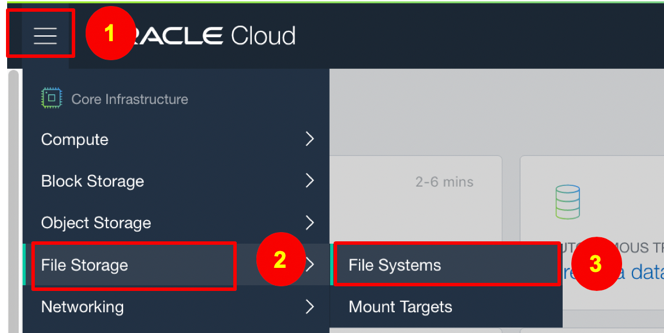
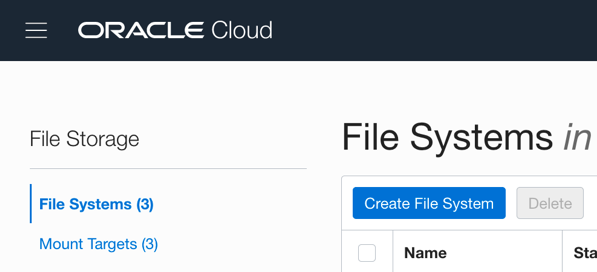
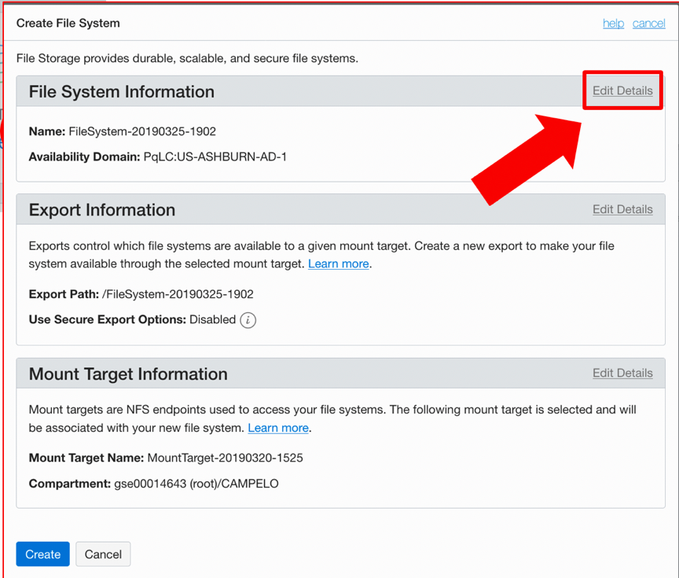
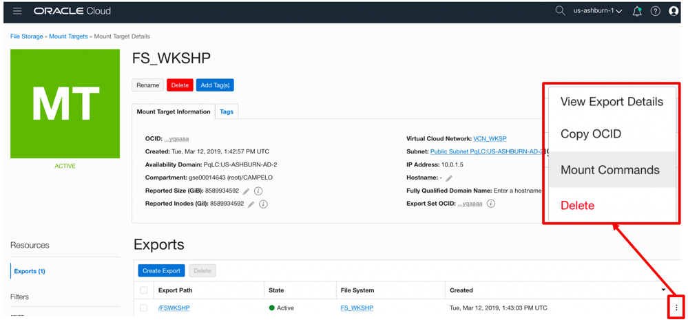
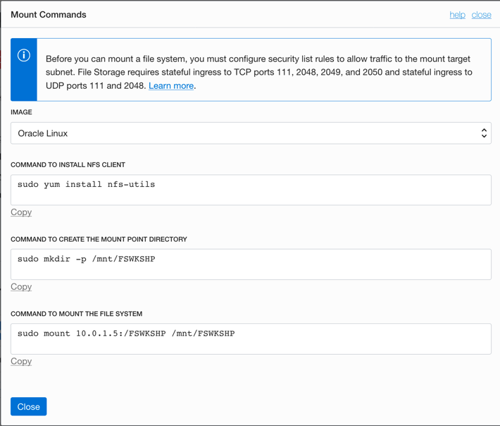

## Lab 5. File Storage Services

Oracle Cloud Infrastructure File Storage service provides a durable, scalable, secure, enterprise-grade network file system. You can connect to a File Storage service file system from any bare metal, virtual machine, or container instance in your Virtual Cloud Network (VCN). You can also access a file system from outside the VCN using Oracle Cloud Infrastructure FastConnect and Internet Protocol security (IPSec) virtual private network (VPN)

Using the File Storage service requires an understanding of the following concepts, including some that pertain to Oracle Cloud Infrastructure Networking:

- Mount Target
An NFS endpoint that lives in a subnet of your choice and is highly available. The mount target provides the IP address or DNS name that is used in the mount command when connecting NFS clients to a file system. A single mount target can export many file systems

- Export 
Exports control how NFS clients access file systems when they connect to a mount target. File systems are exported (made available) through mount targets. Each mount target maintains an export set which contains one or many exports.

##Objective
Create a FileStorage Service filesystem, and access it through a Linux Compute Instance

## Creating File Storage Service FileSystem 

1 – Access FileStorage Service main screen through OCI Main page on Action Menu

Hit Create File system Button on the right

You’ll see a pop-up screen requesting the main information to identify FileStorage Service. You will note, that the main fields are already filled with default information.  Use the “Edit” button on the right, to customize the filesystem info with your data.

## You will have to provide: 
- FileSystem Name
- Availability Domain
- Export Path Name
- Mount Target Name
- Compartment

##Creating Mount Targets 
Please note, that a Mount Target is automatically created by the Cloud Orchestration. All you have to do, is select the Mount Target, and get the connection details.

Select the created Mount Target to get it’s details, then, on the “Export’s” action menu, on the right, select “Mount Commands”, and you’ll get a screen with connectivity information regarding the Mount Target.

Here Oracle Cloud follows the same behavior as in the other wizards. All you need to do, is “copy” and “Paste” the Linux commands on SSH prompt.

##Connectivity Issues
FileStorage is a network service, and as such, it’s usage, is subordinated to firewall rules. In order to mount the created mount target, we’re going to create an Ingress Security Rule, to allow FileStorage Service IP traffic.

SOURCE CIDR is the IP address attached to the Mount Target. You can get this information on the “Mount Target” screen.

DESTINATION PORT, File Storage requires some ports do be opened (2048 – 2050, 111, 2048 and  111). In our example, we don’t need to specify any port, so all traffic from File Storage’s IP will be allowed.

